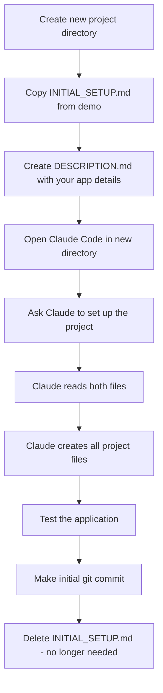

# Start Your Own App

Create a new aide-frame application with Claude's help.

## Overview

This guide explains how to create a new application based on aide-frame using Claude Code as your assistant. The process uses two files:

- **DESCRIPTION.md** - You fill this with your app's details
- **INITIAL_SETUP.md** - Instructions for Claude (copy from this demo)



## Step 1: Create Project Directory

```bash
mkdir my-new-app
cd my-new-app
```

## Step 2: Copy Setup Instructions

Copy `INITIAL_SETUP.md` from this demo to your new project:

```bash
cp /path/to/aide-frame-demo-js/INITIAL_SETUP.md .
```

## Step 3: Create DESCRIPTION.md

Create a file called `DESCRIPTION.md` with your app configuration:

```markdown
# Project Description

## App Configuration

APP_NAME: My App Name
APP_NAME_LOWER: myapp
APP_DESCRIPTION: Brief description of what your app does
PORT: 8086

## Purpose

Describe what your application will do.

## Setup Requirements

- Any specific requirements or customizations
- Features you want to include or exclude
```

## Step 4: Run Claude Code

Open Claude Code in your new project directory and say:

> "Please read INITIAL_SETUP.md and set up this project"

Claude will:
1. Read your DESCRIPTION.md for configuration
2. Follow INITIAL_SETUP.md instructions
3. Use this demo as a reference template
4. Create all necessary files
5. Guide you through testing and committing

## What Gets Created

| File | Purpose |
|------|---------|
| `package.json` | Node.js dependencies |
| `run` | Startup script |
| `app/{name}.js` | Server entry point |
| `app/config.json` | Port configuration |
| `app/VERSION` | Version number |
| `app/static/{name}/` | HTML, JS, CSS |
| `app/static/locales/` | i18n translations |
| `app/docs/index.md` | About page content |
| `app/help/index.md` | Help page content |
| `.gitignore` | Excludes node_modules |

## After Setup

1. Test: `./run` and open http://localhost:{PORT}
2. Verify header, content, and footer work
3. Commit: `git add . && git commit -m "Initial setup"`
4. Delete `INITIAL_SETUP.md` (no longer needed)

## Notes

- **Python version**: A similar process exists for the Python demo
- **Customization**: Modify the generated files to add your app's functionality
- **Updates**: The generated app includes update functionality via GitHub releases
