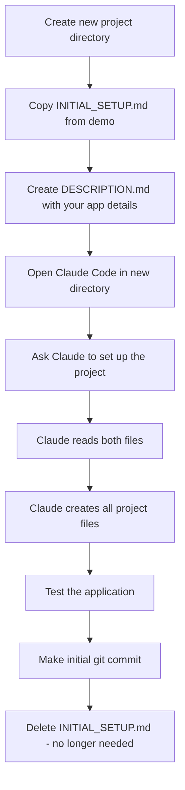

# Start Your Own App

Create a new aide-frame application with Claude's help.

## Overview

This guide explains how to create a new application based on aide-frame using Claude Code as your assistant. The process uses two files:

- **DESCRIPTION.md** - You fill this with your app's details
- **INITIAL_SETUP.md** - Instructions for Claude (copy from a demo)



## Step 1: Create Project Directory

```bash
mkdir my-new-app
cd my-new-app
```

## Step 2: Copy Setup Instructions

Copy `INITIAL_SETUP.md` from this demo to your new project:

```bash
cp /path/to/aide-frame-demo-js/INITIAL_SETUP.md .
```

## Step 3: Create DESCRIPTION.md

Create a file called `DESCRIPTION.md` with your app configuration:

```markdown
# Project Description

## App Configuration

APP_NAME: My App Name
APP_NAME_LOWER: myapp
APP_DESCRIPTION: Brief description of what your app does
PORT: 8086

## Purpose

Describe what your application will do.

## Setup Requirements

- Any specific requirements or customizations
- Features you want to include or exclude
```

## Step 4: Run Claude Code

Open Claude Code in your new project directory and say:

> "Please read INITIAL_SETUP.md and set up this project"

Claude will:
1. Read your DESCRIPTION.md for configuration
2. Follow INITIAL_SETUP.md instructions
3. Use this demo as a reference template
4. Create all necessary files
5. Guide you through testing and committing

## What Gets Created (Node.js)

| File | Purpose |
|------|---------|
| `package.json` | Node.js dependencies |
| `run` | Startup script |
| `app/{name}.js` | Server entry point |
| `app/config.json` | Configuration (port, PWA settings) |
| `app/VERSION` | Version number |
| `app/static/{name}/` | HTML, JS, CSS |
| `app/static/icons/` | PWA icons (icon-192.svg, icon-512.svg) |
| `app/static/locales/` | i18n translations |
| `app/docs/index.md` | About page content |
| `app/help/index.md` | Help page content |
| `.gitignore` | Excludes node_modules |

## Creating App Icons (PWA)

Your app needs its own icons so users can install it as a distinct PWA. Create two SVG files:

- `app/static/icons/icon-192.svg` (192x192 pixels)
- `app/static/icons/icon-512.svg` (512x512 pixels)

### SVG Template

Use this template, customizing the colors and text:

```svg
<svg xmlns="http://www.w3.org/2000/svg" width="192" height="192" viewBox="0 0 192 192">
  <rect width="192" height="192" fill="#YOUR_BG_COLOR"/>
  <text x="96" y="120" font-family="Arial, sans-serif" font-size="80"
        font-weight="bold" fill="#YOUR_TEXT_COLOR" text-anchor="middle">XX</text>
</svg>
```

For the 512x512 version, change `width`, `height`, `viewBox` to 512, and adjust `font-size` to ~200 and `y` position to ~320.

### Examples

| App | Background | Text Color | Label |
|-----|------------|------------|-------|
| Node.js demo | `#F7DF1E` (yellow) | `#000000` (black) | JS |
| Python demo | `#306998` (blue) | `#FFD43B` (yellow) | Py |
| Your app | Choose your brand colors | Contrasting color | 2-3 letter abbreviation |

### PWA Configuration

Configure your icons in `app/config.json`:

```json
{
    "port": 8086,
    "pwa": {
        "enabled": true,
        "name": "Your App Name",
        "short_name": "YourApp",
        "description": "Brief description",
        "theme_color": "#YOUR_BG_COLOR",
        "background_color": "#ffffff",
        "icon_192": "/static/icons/icon-192.svg",
        "icon_512": "/static/icons/icon-512.svg"
    }
}
```

The `theme_color` should match your icon's background color for a cohesive look.

## After Setup

1. Test: `./run` and open http://localhost:{PORT}
2. Verify header, content, and footer work
3. Test PWA: Check browser shows install option, try installing the app
4. Commit: `git add . && git commit -m "Initial setup"`
5. Delete `INITIAL_SETUP.md` (no longer needed)

## Notes

- **Python version**: A similar process exists for the Python demo
- **Customization**: Modify the generated files to add your app's functionality
- **Updates**: The generated app includes update functionality via GitHub releases
